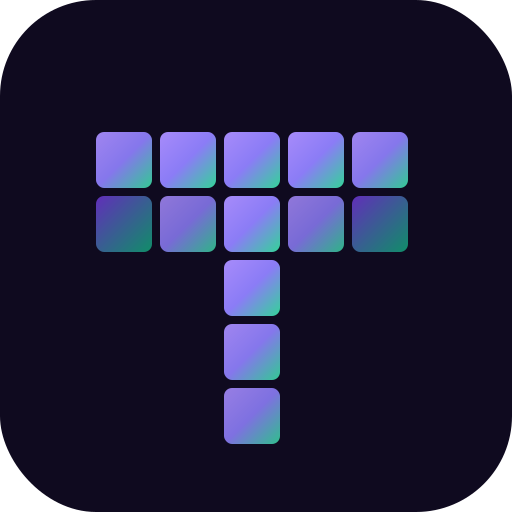

<p align="center">
  
</p>

<h1 align="center">Tessera</h1>

<p align="center">
  A byte-level BPE tokenizer <strong>library</strong> in pure Kotlin.<br/>
  <em>Tessera</em> — from Latin, a piece of mosaic. Each token is a tessera; together they form the mosaic of language.
</p>

## Status

✅ **v0.0.1** — all phases complete.

See [ARCHITECTURE.md](./ARCHITECTURE.md) for internals and [BENCHMARKS.md](./BENCHMARKS.md) for test results.

## About

Tessera is a **Kotlin library** that implements a byte-level **Byte-Pair Encoding** (BPE) tokenizer in the style of GPT-4's `cl100k_base`. Built from scratch in **pure Kotlin**, with no ML framework dependencies, it is designed for developers who want to understand how modern tokenizers work and for Kotlin/JVM projects that need a lean, readable tokenization library.

### Principles

- **Library, not application** — designed to be consumed by other Kotlin projects
- **Pure Kotlin** — no DJL, no KInference, no ML frameworks
- **Standard library only** for tokenization logic
- **Byte-level** — base vocabulary of 256 bytes, supports any UTF-8 input
- **GPT-4 compatible approach** — pre-tokenization with `cl100k_base` regex
- **Minimal public API** — only what is necessary, explicitly marked

## Installation (after v0.0.1 release)

### Gradle (Kotlin DSL)

```kotlin
// settings.gradle.kts
dependencyResolutionManagement {
    repositories {
        maven { url = uri("https://jitpack.io") }
    }
}

// build.gradle.kts
dependencies {
    implementation("com.github.HectorIFC:tessera:tessera-core-v0.0.1")
}
```

## Quick start

```kotlin
import dev.tessera.BpeTokenizer
import dev.tessera.Trainer
import dev.tessera.TrainingConfig

fun main() {
    // 1. Train a tokenizer from a corpus
    val tokenizer = Trainer(TrainingConfig(numMerges = 5000))
        .trainFromFile("corpus/text.txt")

    // 2. Save for later reuse
    tokenizer.save("tessera.json")

    // 3. Load and use
    val loaded = BpeTokenizer.load("tessera.json")
    val ids = loaded.encode("Hello, world!")
    val text = loaded.decode(ids)
    println("$ids → $text")
}
```

More examples in the [`tessera-samples`](./tessera-samples/) module.

## Project structure

This is a **Gradle multi-module** project:

```
tessera/
├── tessera-core/      ← The library (published artifact)
├── tessera-cli/       ← CLI application consuming the library
└── tessera-samples/   ← Usage examples
```

- **`tessera-core`**: the consumable JAR. Minimal public API, no runtime dependencies beyond Kotlin stdlib and kotlinx-serialization.
- **`tessera-cli`**: runnable application (`./gradlew :tessera-cli:run`) demonstrating the library in use.
- **`tessera-samples`**: small Kotlin programs with `main()` showing usage patterns.

## Running locally

```bash
# Build everything
./gradlew build

# Run tests
./gradlew test

# Run the full quality pipeline
./gradlew test koverVerify ktlintCheck detekt

# Install the library in Maven Local for testing in other projects
./gradlew publishToMavenLocal

# Run the CLI
./gradlew :tessera-cli:run --args="train --corpus corpus/text.txt --merges 5000 --output tessera.json"

# Run a sample
./gradlew :tessera-samples:run -PmainClass=dev.tessera.samples.QuickStartSampleKt
```

## Architecture

At a high level:

1. **Pre-tokenization**: text is split into logical chunks (words, contractions, numbers, punctuation) by a GPT-4-style regex.
2. **Byte conversion**: each chunk becomes a sequence of UTF-8 bytes (0–255).
3. **BPE**: the learned algorithm iteratively merges the most frequent byte pairs, building composite tokens.
4. **Greedy encode**: at inference time, always apply the merge with the lowest rank (learned first), reproducing GPT behaviour.

See [ARCHITECTURE.md](./ARCHITECTURE.md) (created in Phase 5) for technical details.

## Roadmap

- [x] Define scope and architecture
- [x] **Phase 0**: Gradle multi-module setup
- [x] **Phase 1**: Core library with round-trip guarantee and stable public API
- [x] **Phase 2**: Sample apps consuming the library
- [x] **Phase 3**: CLI consuming the library
- [x] **Phase 4**: Validation against tiktoken, fuzz tests, coverage ≥ 80%
- [x] **Phase 5**: JitPack publication, ARCHITECTURE.md, full KDoc

## Sister project

Once Tessera is complete, the next step is a **separate codebase** for embeddings that will consume `tessera-core` as a Gradle dependency.

## License

MIT — see [LICENSE](./LICENSE).
